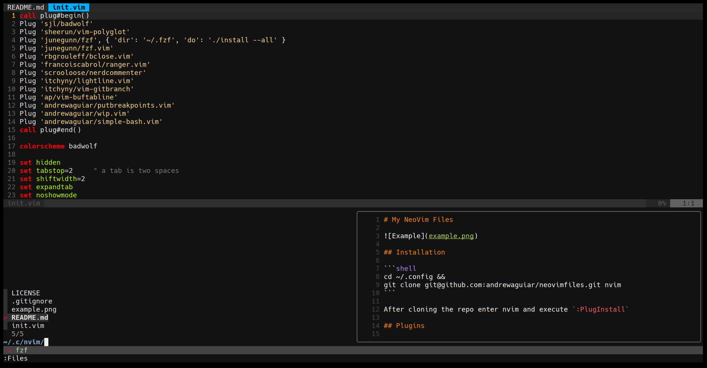

# My NeoVim Files



## Installation

```shell
cd ~/.config &&
git clone git@github.com:andrewaguiar/neovimfiles.git nvim
```

After cloning the repo enter nvim and execute `:PlugInstall`

## Plugins

  - Badwolf: Color schema BadWolf for the win.
  - Vim-polyglot: Syntax for several languages.
  - FZF: Fuzzy searching and auto complete (mapped as `ctrl p`).
  - NerdTree: Opens a file tree navegation.
  - NerdCommenter: Easy comment / uncomment (mapped as `leader cc` / `leader cu`).
  - Lightline: Beautiful status bar.

## Useful Commands

  - Leader: `,`
  - Command: `;`
  - Navigation: `h j k l`
  - Buffer navigation: `← →`
  - Window navigation: `shift` + `← → ↑ ↓`
  - Buffers: `,,`
  - NerdTree: `f2`

### Copy / Paste

  - Paste from External: `f3`
  - Copy to External: `f4`

### Searching

  - Clean searching: `,` + `<space>`
  - Search files: `ctrl` + `p`
  - Auto complete: `ctrl` + `p`
  - Search terms in files: `:` + `Ag <term> [paths]`

### All buffers

  - Quit all buffers: `,` + `q`
  - Delete all buffers: `,` + `bd`
  - Save all buffers: `,` + `w`

### Programming

  - Put breakpoint 1: `,` + `p`
  - Put breakpoint 2: `,` + `p1`
  - Comment: `,` + `cc`
  - Uncomment: `,` + `cu`
  - Generate tags (CTags): `,` + `cg`
  - Search tags (CTags): `,` + `c`

### Files / Dir shortcuts

  - Create missing buffer path: `,` + `mk`
  - Remove current buffer file: `,` + `rm`
